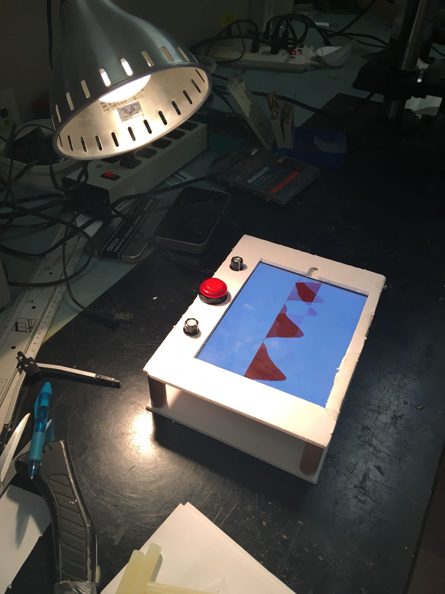
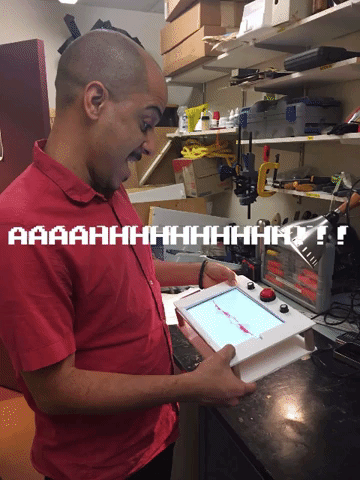
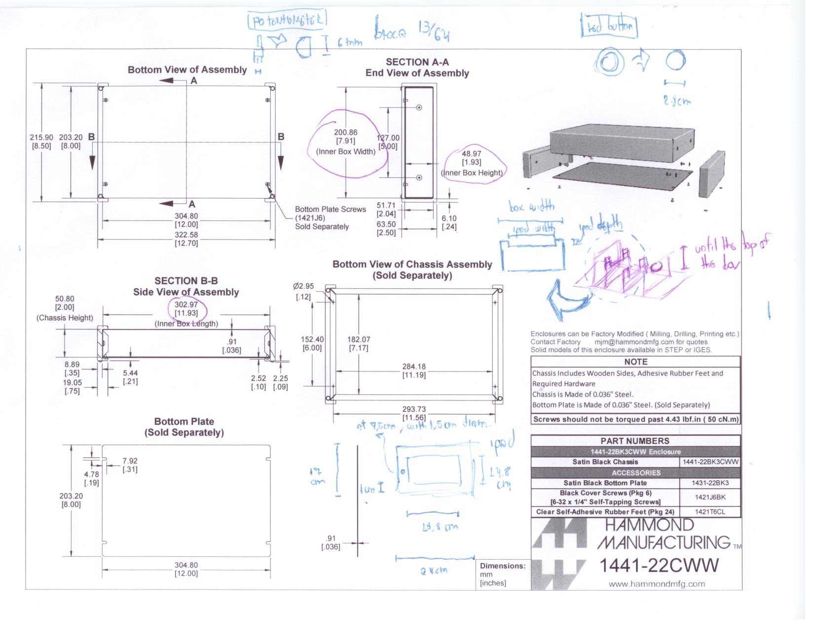
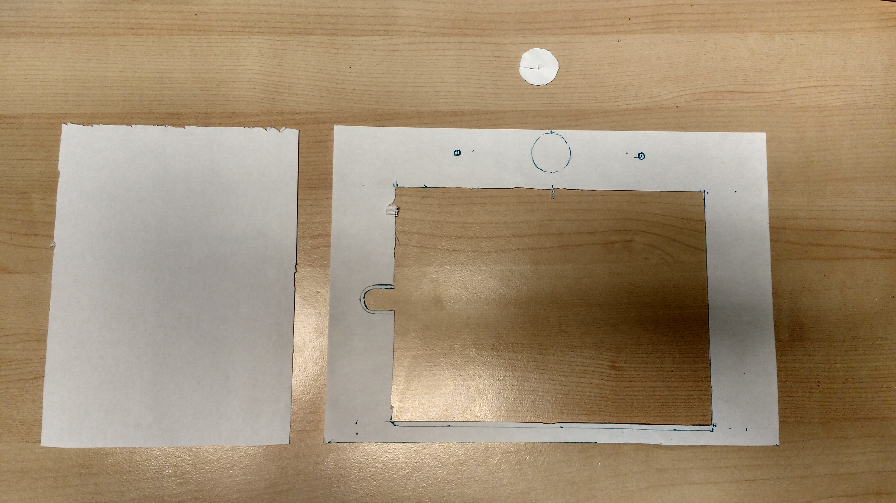
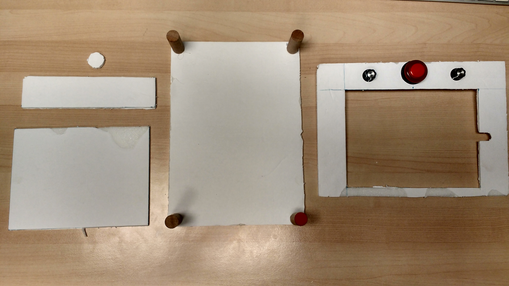
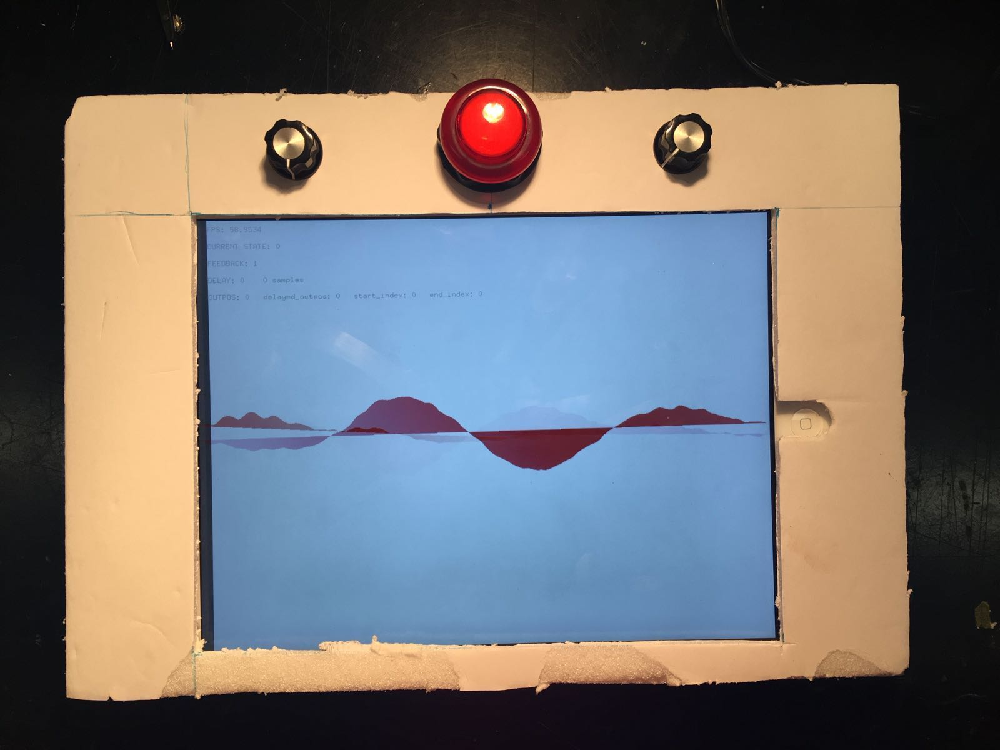
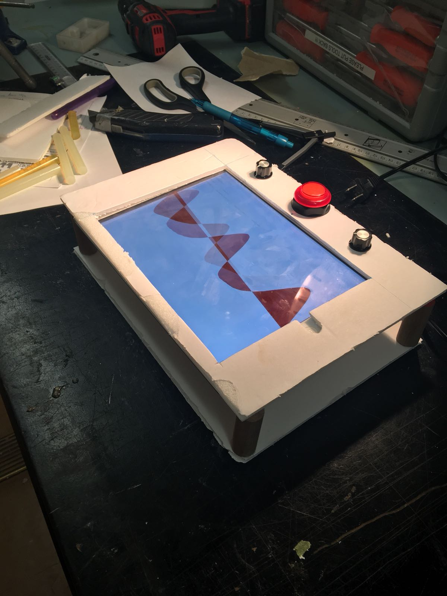

# Enclosure prototyping

This file deals with the prototyping of the enclosure. The steps I followed to build this enclosure are detailed in the next subsections.

## Finding a potential box as baseline
First, Edu pointed [Hammond website](https://www.hammfg.com) containing has several different types of enclosures that can be used in DIY projects.

Based on the measures of the iPad, I found three boxes (list [here](https://docs.google.com/spreadsheets/d/1D_RBQ6R6dxn2w-e68LABvtBa7pAwvGjO6KwVCHRj6x4/edit?usp=sharing)) that could potentially work for the project. After discussing them with Darryl, decided to start prototyping using [this one here](https://www.hammfg.com/part/1441-22BK3CWW?referer=1234) as base deadline.

The measures I used are:

## Paper protyping
Based on the [official measures of that enclosure](https://www.hammfg.com/files/parts/pdf/1441-22BK3CWW.pdf), I did a paper prototype. First, I cut an letter-sized paper on the exact dimensions of the box. Then I have cut out holes in the size of the iPad screen, the buttons, and the potentiometers. The result is the following:

## Cardboard prototyping
Based on the paper prototype, I've built the following cardboard prototype:

## Result
Can be found here:

## Darryl suggestions
They are:
- Try a smaller button;
- Use stranded wires;
- Use 90º jacks and lightning cables for saving space;

## Next steps
- Test how to power the iPad 7 the circuits;
- Test sound input/output on the iPad;
- Power on off button;
- Solder final circuit on Perfboard.
