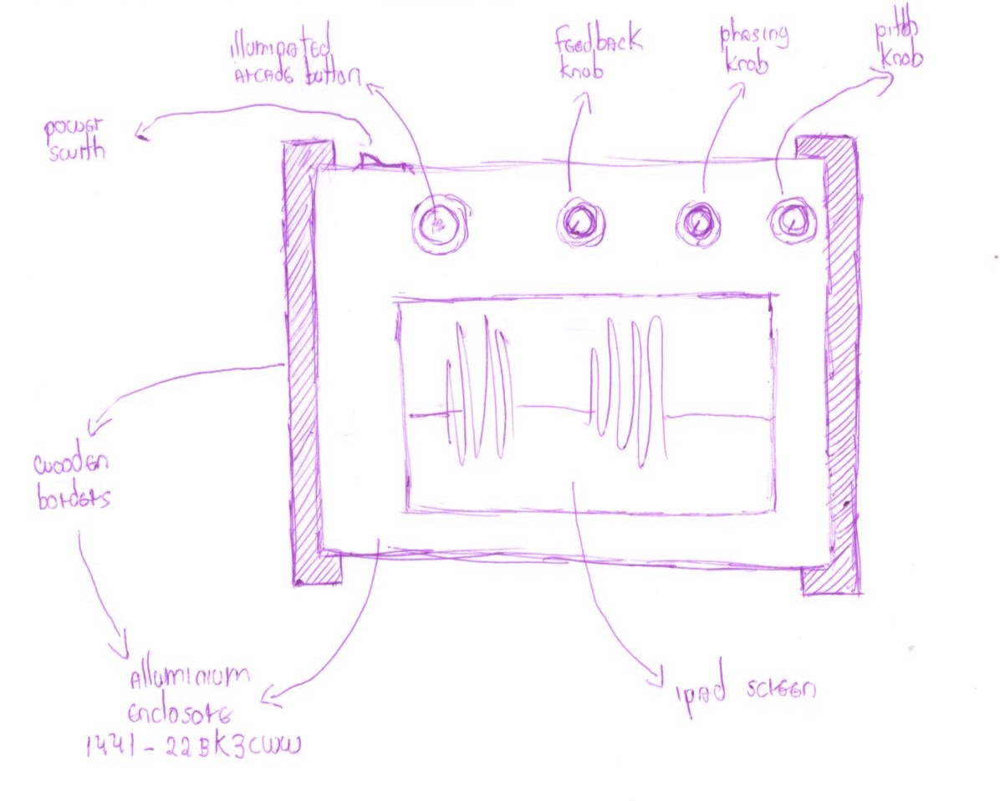
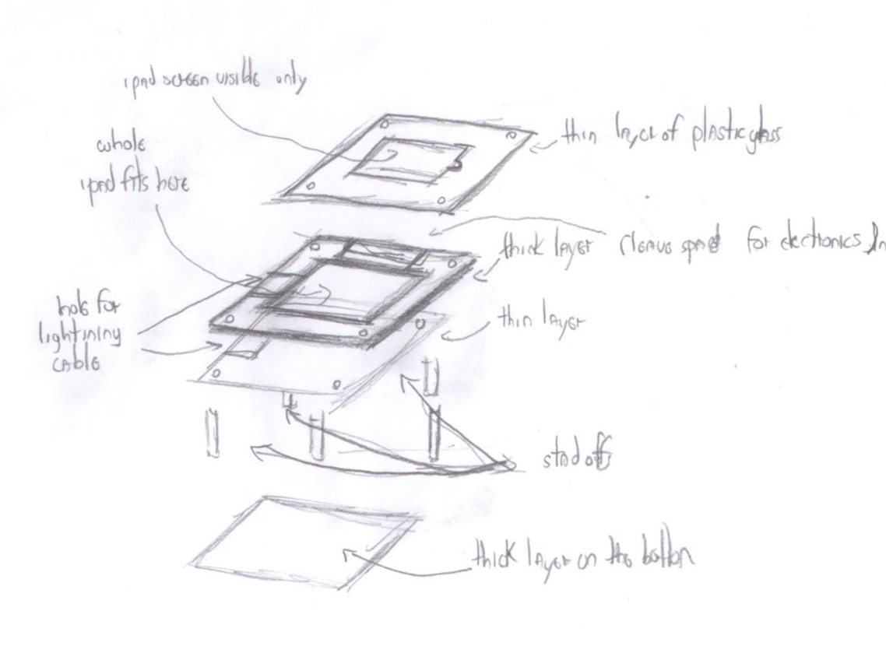

# Enclosure prototyping
This file deals with the prototyping of the enclosure. The research I've done to build the enclosure is detailed in the next subsections.

## Initial sketch
My initial sketch was the following:

### Finding a potential box as baseline
First, Edu pointed [Hammond website](https://www.hammfg.com) containing has several different types of enclosures that can be used in DIY projects.

Based on the measures of the iPad, I found three boxes (list [here](https://docs.google.com/spreadsheets/d/1D_RBQ6R6dxn2w-e68LABvtBa7pAwvGjO6KwVCHRj6x4/edit?usp=sharing)) that could potentially work for the project. After discussing them with Darryl, decided to start prototyping using [this one here](https://www.hammfg.com/part/1441-22BK3CWW?referer=1234) as baseline.

The measures I used are:

## Iteration 1: Paper prototype
Based on the [official measures of that enclosure](https://www.hammfg.com/files/parts/pdf/1441-22BK3CWW.pdf), I did a paper prototype. First, I cut an letter-sized paper on the exact dimensions of the box. Then I have cut out holes in the size of the iPad screen, the buttons, and the potentiometers. The result is the following:

## Iteration 2: Cardboard prototype
Based on the paper prototype, I've built the following cardboard prototype:

This prototype provided a more concrete idea of the general look & feel. However, some important aspects remained unexplored. Namely:

### How to place the iPad under the top structure?
Here, I considered different solutions. One option would be [Jeffrey Stephenson's iPad TV box](http://slipperyskip.com/page38.html) (similar solution [here](https://www.youtube.com/watch?v=WuSLoM4i7Og)). Another would be to create a 'bed' on wood, and then cover it with a thin layer of plexiglass (such as [here](https://www.youtube.com/watch?v=Mjn0Njk-Nx8) and [here](https://www.youtube.com/watch?v=dWabuJQFBD0))

After a while, I decided to go with a sandwich of layers built with laser cutters, as shown in the image below:

### How to hold still other hardware (i.e. FocusRite, USB hub, circuit) inside the enclosure?
Brainstormed solutions:
- Sandwiching and against top and bottom parts?
- 3D printed case glued to bottom part?
- Wooden blocks to allow sandwich of the USB hub?

In the end, I think the easiest solution will be sandwiching only the Focusrite (with maybe some carving in the top). In my tests, the USB hub seems to stand still when all cables are connected.

### How to properly fix & separate bottom and upper layers?
Use [standoffs](https://www.mcmaster.com/#spacers-and-standoffs/=b5fq5j), the same strategy used by Ivan on its first Mitt prototype. In email, he said I could find them on [Home Depot Beaubien](https://www.homedepot.ca/en/home.html).

## Solid prototype
Defined that, I'll try to move on to something more solid. Regarding this, I found a bunch of useful resources at [ITP's fabrication courses webpage](https://itp.nyu.edu/fab/).

For this stage, I'll need to investigate:
1. Drawing an SVG model for the top structure for the 3D printing;
2. Solder input (i.e. button and potentiometers) and circuit into their final place;
